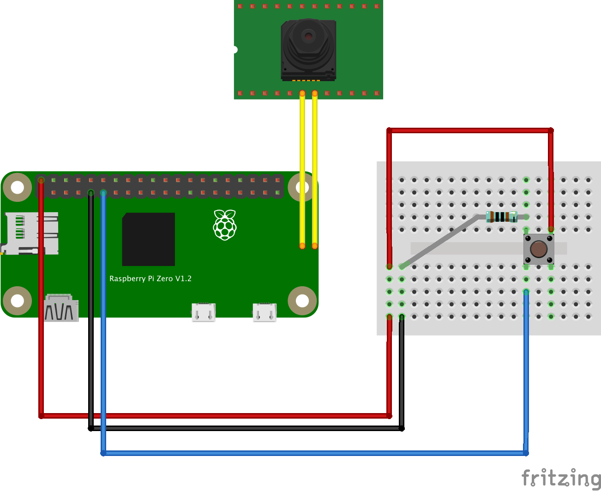

<!-- markdownlint-disable MD033 MD041 -->
<p align="center">
  <h1 align="center">RPi Smart Doorbell</h1>
</p>

## How it works?

First we need to listen for interactions with the button plugged on GPIO port `17`. Then, when the button has a `HIGH` value (represented as a binary `1`), we invoke `raspistill` via the `pi-camera-connect` module to take a picture and stored it locally and then upload to Cloudinary. With that done, a message is sent to a private Discord channel through a Webhook that will show who's at the door.

## Hardware

Here's how its arranged:

<p align="center">
  
</p>

The parts list is:

- Raspberry Pi Zero W
- Pi Camera Module
- 1K resistor
- Push button
- Some wires
- Breadboard

## Software

- NodeJS 14, with the following modules:
  - [onoff](https://github.com/fivdi/onoff): GPIO interaction
  - [pi-camera-connect](https://github.com/launchcodedev/pi-camera-connect): `raspistill` and `raspivid` wrapper written in Typescript
  - [cloudinary](https://github.com/cloudinary/cloudinary_npm): easy image upload to the cloud
  - [pino](https://github.com/pinojs/pino): low overhead logger
  - [node-fetch](https://github.com/node-fetch/node-fetch): HTTP requests with Fetch API, used to send POST requests to Discord webhook
  - [dotenv](https://github.com/motdotla/dotenv): store sensitive credentials on environment variables

## Running on your Pi

It is expected that your Pi is already configured with Raspberry Pi OS (or any other compatible Linux distro) and has SSH and Camera enabled.

Also, the deploy script will connect to the Pi using the address `pizero.local` and user `pi`, so make sure it's properly mapped on your machine's `hosts` file (or on your router). In case you want to use any other address, just edit the script and be happy :)

To deploy the code, do the following:

```sh
# 1. Upload the code with rsync:
$ ./scripts/deploy.sh

# 2. SSH into your Pi
$ ssh pi@pizero.local

# 3. Navigate to project directory
$ cd ~/dev/rpi-node-doorbell

# 4. Install dependencies
$ npm install

# 5. Run!
$ npm start
```

### Running on system startup

WIP
